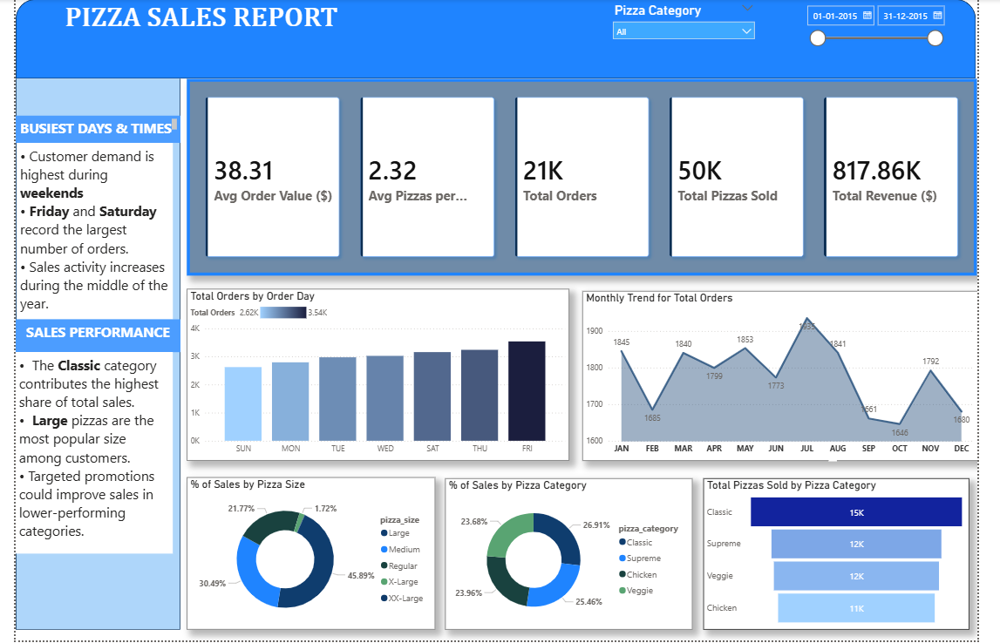

#  Pizza Sales Analytics Dashboard

> **A business intelligence project that analyzes over 48,000 pizza sales transactions using Microsoft SQL Server and Power BI to uncover sales trends, customer behaviour, and product performance.**

---

## ** Project Overview**

This project demonstrates how SQL and Power BI can be used together to transform raw business data into meaningful insights for decision-making.

The project was completed in two stages:

- **Stage 1 – SQL Analysis:** Develop SQL queries to calculate KPIs, identify trends, and analyse product performance.
- **Stage 2 – Power BI Dashboard:** Design an interactive dashboard and validate all KPI results against SQL outputs to ensure data accuracy.

This workflow reflects a typical business intelligence process used in industry.

---

## ** Business Objective**

The objective of this project is to help a pizza restaurant understand its business performance by answering important questions such as:

| Business Question | Analysis Type |
|-------------------|---------------|
| How much revenue was generated? | KPI Analysis |
| Which days and months have the highest sales? | Trend Analysis |
| Which pizza categories and sizes are most popular? | Sales Analysis |
| Which products perform the best and worst? | Product Performance |

---

## ** Dashboard Overview**


### **Page 1 – Sales Overview**



### **Page 2 – Product Performance**


---

## ** Key Business Insights**

### **Revenue Performance**

- Generated **$817.86K** in total revenue from **21,350 customer orders**.
- Average order value was **$38.31**.
- Customers purchased an average of **2.32 pizzas per order**.
- A total of **49,574 pizzas** were sold during the year.

### **Customer Ordering Trends**

- **Friday** recorded the highest number of orders, followed by Thursday and Saturday.
- **July** achieved the strongest monthly sales performance.
- Customer demand remained consistently higher during weekends compared to weekdays.

### **Sales Analysis**

- The **Classic** category contributed the largest share of overall revenue.
- **Large-sized pizzas** accounted for the highest proportion of total sales.
- **Thai Chicken Pizza** generated the highest revenue.
- **Classic Deluxe Pizza** recorded the highest quantity sold and total customer orders.

### **Business Recommendations**

- **Brie Carre Pizza** was the lowest-performing menu item across revenue, quantity sold, and total orders.
- Promotional efforts could focus on top-selling pizzas to maximise revenue.
- Marketing campaigns during lower-demand months may help improve seasonal sales.

---

## ** Tools & Technologies**

| Tool | Purpose |
|------|----------|
| Microsoft SQL Server | Database Management |
| SQL (T-SQL) | Data Analysis & KPI Queries |
| Power BI Desktop | Dashboard Development |
| Power Query | Data Cleaning & Transformation |
| DAX | Calculated Measures & KPIs |

---

## ** Dataset Information**

- **Dataset:** Pizza Sales
- **Records:** 48,620
- **Columns:** 12
- **Time Period:** January 2015 – December 2015
- **Granularity:** One record represents one pizza sold.

---

## ** Data Preparation**

The dataset was cleaned using **Power Query** before dashboard development.

The preparation included:

- Converting pizza size abbreviations into descriptive labels.
- Creating weekday names from order dates.
- Adding custom columns for correct weekday sorting.
- Creating month numbers to display months chronologically.

---

## ** DAX Measures**

```DAX
Total Revenue = SUM(pizza_sales[total_price])

Total Orders = DISTINCTCOUNT(pizza_sales[order_id])

Total Pizzas Sold = SUM(pizza_sales[quantity])

Average Order Value = DIVIDE([Total Revenue],[Total Orders])

Average Pizzas per Order = DIVIDE([Total Pizzas Sold],[Total Orders])
```

---

## ** SQL Validation**

All KPI values displayed in Power BI were validated against SQL query results to ensure consistency and accuracy.

| KPI | SQL | Power BI |
|-----|-----|-----------|
| Total Revenue | $817,860 | $817.86K |
| Average Order Value | $38.30 | $38.31 |
| Total Orders | 21,350 | 21,350 |
| Total Pizzas Sold | 49,574 | 49,574 |
| Average Pizzas per Order | 2.32 | 2.32 |

---

## ** Repository Structure**

```text
pizza-sales-analysis/
│
├── README.md
├── Pizza.Sale.SQL.Queries.sql
├── pizza_sales.csv
├── pizza_sales_dashboard.pbix
├── home.png
└── best_worst.png
```

---

## ** How to Use**

1. Download or clone this repository.
2. Open `pizza_sales_dashboard.pbix` using Power BI Desktop.
3. Explore the dashboard using the available slicers and filters.
4. Review the SQL queries in SQL Server Management Studio.

---

## ** Dashboard Features**

- Interactive KPI cards
- Sales trend analysis
- Product performance analysis
- Dynamic slicers
- Cross-filtering across visuals
- Two-page interactive dashboard
- SQL-validated business metrics

---

## **👨‍💻 Author**

**Jupendra Kumar**

MSc Business Analytics | Maynooth University

